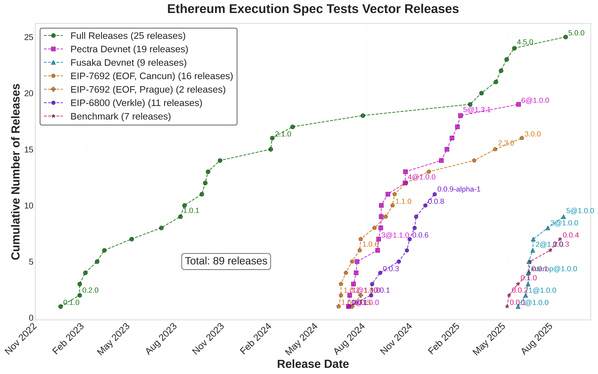

# EEST Release Timeline Visualization

## Overview

The scripts in this folder generate a plot showing Ethereum Execution Spec Tests (EEST) release timelines:



## Prerequisites

Github CLI and `uv`: See [../README.md](../README.md).

## Generating the Plots

1. **Fetch data** (run once):

   ```bash
   uv run release_timeline/fetch_release_data.py
   ```

2. **Generate plots**: Uses data from `build/releases.txt`; omit `--light` for dark-mode:

   ```bash
   uv run release_timeline/generate_plots.py --light
   ```

## Generated Files

All generated files are written to the `./build/` directory, which can be safely deleted and recreated:

- **`build/eest_releases_timeline.png`** - Standard resolution (150 DPI).
- **`build/eest_releases_timeline_hires.png`** - High resolution (300 DPI) for presentations.
- **`build/releases.txt`** - Raw release data from GitHub API: Used by `generate_plots.py`.
- **`build/releases_chronological.md`** - Human-readable chronological release list.
