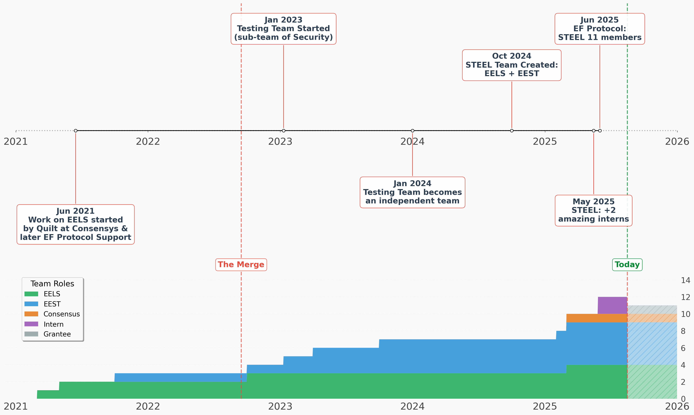

# STEEL Team Timeline Visualization

## Overview

The scripts in this folder generate a plot showing the evolution of the STEEL (EELS + EEST) team over time:



## Prerequisites

`uv`: See [../README.md](../README.md).

## Generating the Plot

```bash
uv run team_timeline.py
```

## Generated Files

All generated files are written to the `./build/` directory, which can be safely deleted and recreated:

- **`build/team_timeline.png`** - Team timeline visualization showing team milestones and member count evolution.
